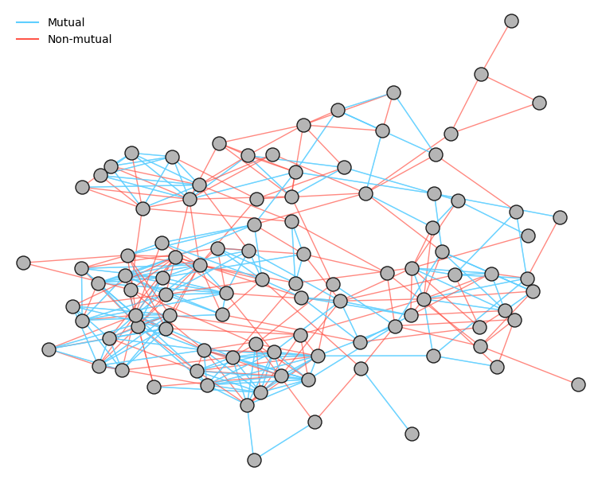
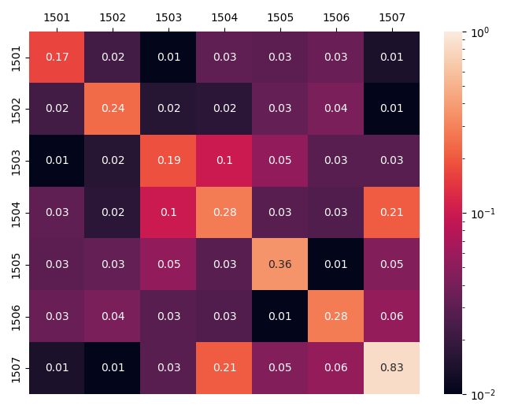

# Social Network Project
Link to article: https://medium.com/@alecchendev/analyzing-the-social-network-of-my-high-school-7763df719363?source=friends_link&sk=62b4f16ac9c4786c71b801b226f7e289
### Motivation
During my junior year in high school I worked with an associate professor of applied mathematics at Illinois Institute of Technology on an independent research project analyzing network sampling methods. Along the way, I learned a lot about network mathematics, and thought of the idea to apply it to the social network of my own high school. I'd always found the varying connectivity of different groups of people very interesting, and I wanted quanitify and analyze this phenomenon I observed in real life. About a year later, I finally got the opportunity to collect responses and the project came into fruition.

### Data
For the sake of people's privacy, I've chosen to only upload the anonymized edge data of the network, however the data I collected and used during the analysis denoted each point as a person, providing their name, residence hall, gender, and a list of the names of people they considered friends. I had to conduct a lot of cleaning because high school students understandably don't put very much effort into writing clean survey responses. I wrote code to correct misspellings and abnormalities/nicknames, and accomodated for the lack of data because not everyone filled it out.

### Results
I made visualizations and wrote analysis for almost everything I found, all of which can be found in the article linked above. You can find all of my visualizations and labels for each in the visualizations folder in this repository, but I'll leave some of my favorites below as eye candy.

