# Visualizations
Here are all the most important and polished visualizations I made for this project. Data visualization was an important aspect of this project, because to effectively communicate the concepts behind the data, my visualizations needed to be elegant and clear. In order of how they appear in the article, here are my visualizations. For full explanation and analysis of all of the following, checkout my article linked in the repo's main readme.

### Network (Plasma)
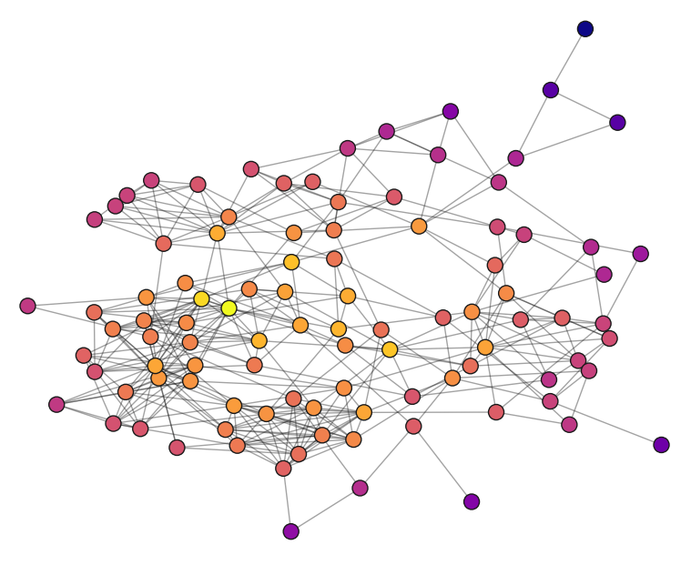

### Network (Blue)
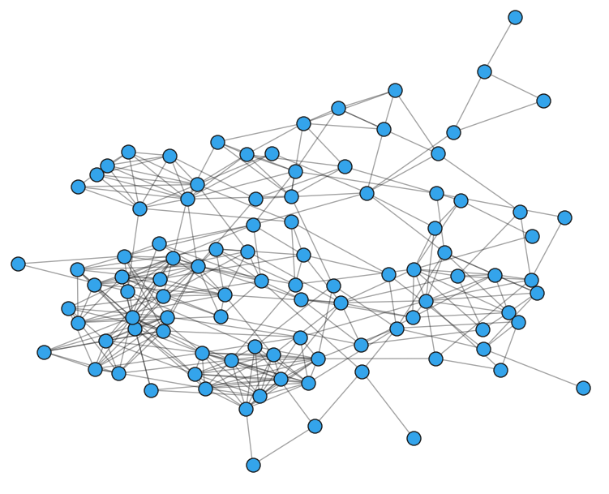

### Degree Distribution
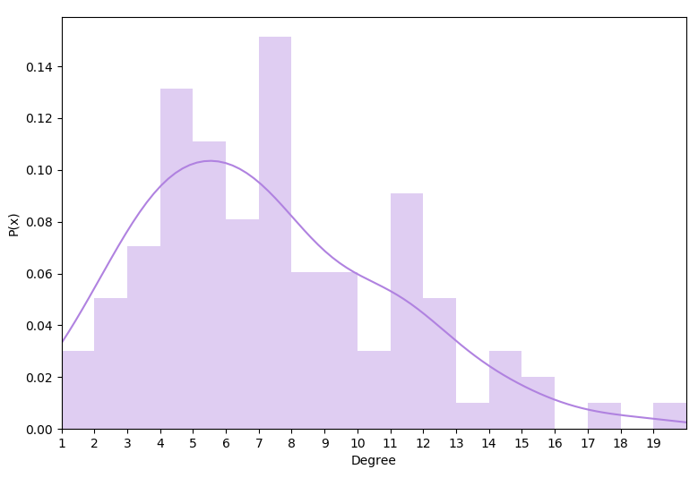

### Clustering Distribution
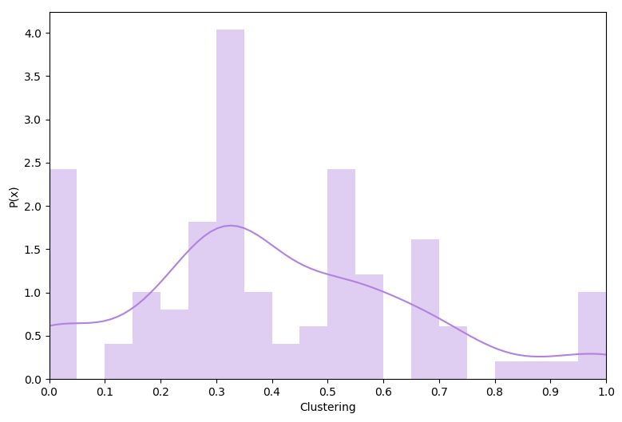

### Shortest Path Length Distribution

### Mutuality Network
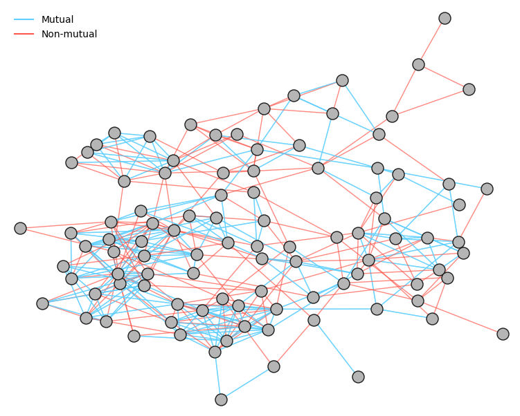

### Gender Network
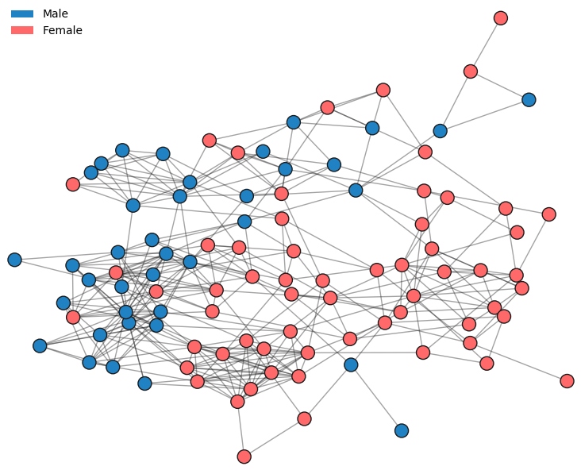

### Friend Probabilities
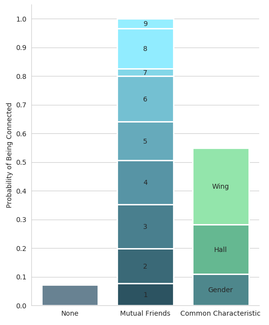

### Friend Composition

### Hall Network
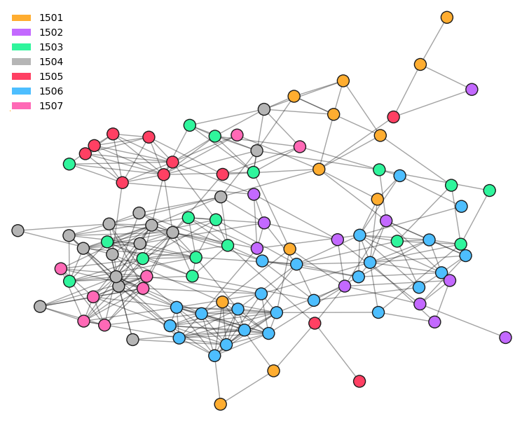

### Hall Degree In/Out
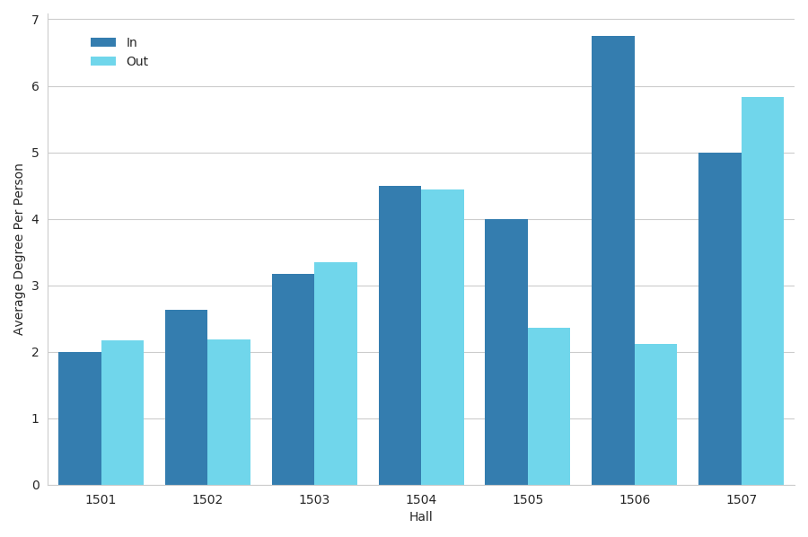

### Responses
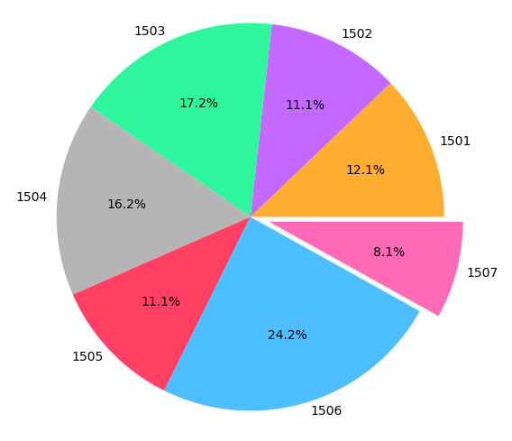

### Hall Connection Heatmap
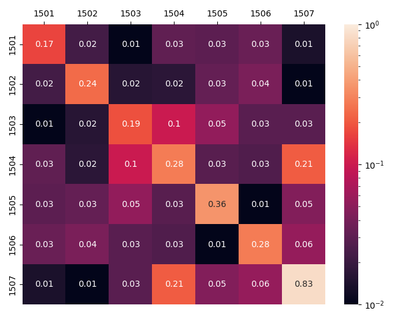
